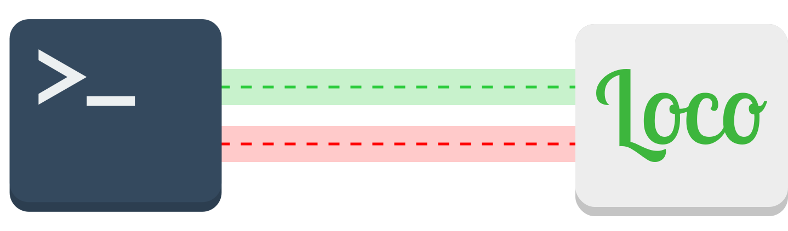

<div align="center">
  <br />
  
  <br />
  <br />
  <h3 align="center">loco-cli</h3>
  <p align="center">

Automatically sync your project translations with [Loco](https://localise.biz).

[](https://www.npmjs.com/package/loco-cli)

[](https://github.com/robrechtme/loco-cli/issues)
[](https://opensource.org/licenses/MIT)
<br />
<br />
<a href="https://github.com/robrechtme/loco-cli/issues">Report Bug</a>
·
<a href="https://github.com/robrechtme/loco-cli/issues">Request Feature</a>

  </p>
</div>

## About

The **Loco CLI** helps you keep your translations bundled in your app/website in sync with [Loco](https://localise.biz).

> Looking for a Python alternative? Try [marten-cz/loco-cli](https://github.com/marten-cz/loco-cli)!

## Getting Started

```
npx loco-cli --help
```

Loco CLI currently has three methods, which are very similar to git commands:

- `loco-cli push`: push translations to Loco.
- `loco-cli pull`: download all translations.
- `loco-cli status`: see which translations are not yet uploaded/downloaded.

The Loco CLI assumes your translations are stored as **JSON** files, one for each language.

```
[locales folder]
 ├── en.json
 ├── es.json
 └── fr.json
```

The keys in the files are asset ID's, and the values are translations. Nested JSON structures produce dottet asset ID's:

```jsonc
{
  "home": {
    "title": "Welcome back, {{name}}" // Asset ID: `home.title`
  }
}
```

### Configuration

Global options are passed as options in the terminal or read from a `loco.config.js` file (recommended) or a `.locorc.{yaml,json,js}` file:

```js
// loco.config.js
/** @type {import('loco-cli/types').Config} */
module.exports = {
  accessKey: '<loco-full-access-key>',
  localesDir: 'src/app/i18n/locales',
  namespaces: false,
  push: {
    'flag-new': 'provisional',
    'tag-new': process.env.npm_package_version,
    'delete-absent': false
  }
};
```

| Config key | CLI flag                     | Type          | Description                                                                                                                                                                                                                        |
| ---------- | ---------------------------- | ------------- | ---------------------------------------------------------------------------------------------------------------------------------------------------------------------------------------------------------------------------------- |
| accessKey  | `-a`, `--access-key <key>`   | `string`      | The API key of the Loco project you wish to sync to/from. You can find this in the Loco project under `Developer Tools › API Keys › Full Access Key` (if you do not intend to use `loco-cli push`, an `Export key` will work too). |
| localesDir | `-d`, `--locales-dir <path>` | `string`      | The folder in which the JSON translation files are stored (defaults to current working dir).                                                                                                                                       |
| namespaces | `-N`, `--namespaces`         | `boolean`     | Organize translations into namespaces (default: `false`). Set this flag to `true` when dividing translations into multiple files. The uploaded asset ID's will be prefixed with `<namespace>:`.                                    |
| maxFiles   | `-m`, `--max-files <number>` | `number`      | Maximum number of modified files to display in diff outputs (default: `20`).                                                                                                                                                       |
| push       | -                            | `PushOptions` | Loco API options used for `loco-cli push`. (https://localise.biz/api/docs/import/import)                                                                                                                                           |
| pull       | -                            | `PullOptions` | Loco API options used for `loco-cli pull`. (https://localise.biz/api/docs/export/exportall)                                                                                                                                        |

<details>
<summary>PushOptions</summary>
<br>

- `experimentalPushAll`: Upload all locales in a single API request instead of one request per locale. This can significantly improve performance for projects with many locales.
- `ignore-new`: Specify that new assets will NOT be added to the project.
- `ignore-existing`: Specify that existing assets encountered in the file will NOT be updated.
- `tag-new`: Tag any NEW assets added during the import with the given tags (comma separated).
- `tag-all`: Tag ALL assets in the file with the given tags (comma separated).
- `untag-all`: Remove existing tags from any assets matched in the imported file (comma separated).
- `tag-updated`: Tag existing assets that are MODIFIED by this import.
- `untag-updated`: Remove existing tags from assets that are MODIFIED during import.
- `tag-absent`: Tag existing assets in the project that are NOT found in the imported file.
- `untag-absent`: Remove existing tags from assets NOT found in the imported file.
- `delete-absent`: Permanently DELETES project assets NOT found in the file (use with extreme caution).
- `flag-new`: Set this flag on any NEW (non-empty) translations imported into the current locale.
</details>

<details>
<summary>PullOptions
</summary>
<br>

- `filter`: Filter assets by comma-separated tag names. Match any tag with `*` and negate tags by prefixing with `!`.
- `fallback`: Fallback locale for untranslated assets, specified as short code. e.g. en or en_GB.
- `order`: Export translations according to asset order.
- `status`: Export translations with a specific status or flag. Negate values by prefixing with !. e.g. "translated", or "!fuzzy".
- `charset`: Specify preferred character encoding. Alternative to Accept-Charset header but accepts a single value which must be valid.
- `breaks`: Force platform-specific line-endings. Default is Unix (LF) breaks.
</details>

## Usage

### `loco-cli status`

Check the diff between local and remote translations.

#### Options

- `--direction [remote|local|both]`: Direction to diff the translations to
  - `remote`: Only check for local translations that are missing remotely
  - `local`: Only check for remote translations that are missing locally
  - `both`: Check both directions

### `loco-cli pull`

Download all translations from Loco. This command will **overwrite** the JSON files in `localesDir` with the assets found in Loco.

#### Options

- `-y, --yes`: Automatically answer yes to all confirmation prompts (default: false)

### `loco-cli push`

Push changes to the translation files to Loco. Depending on the `push` options, this will only add new translations, modify existing translations or even delete translations from Loco that are not present in the local file.

#### Options

- `-y, --yes`: Automatically answer yes to all confirmation prompts (default: false)
- `--experimental-push-all`: Upload all locales in a single API request for improved performance. Reduces API calls from N (one per locale) to 1. Can also be set via `push.experimentalPushAll` in config.

## Contributing

Contributions are what make the open source community such an amazing place to learn, inspire, and create. Any contributions you make are **greatly appreciated**.

If you have a suggestion that would make this better, please fork the repo and create a pull request. You can also simply open an issue.
Don't forget to give the project a star! Thanks again!

## License

Distributed under the MIT License. See [`LICENSE`](./LICENSE) for more information.
